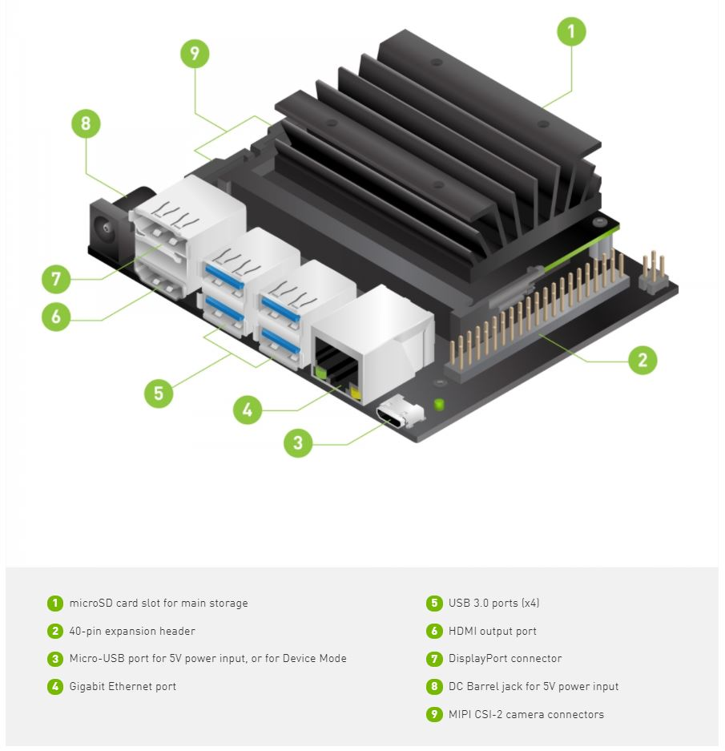
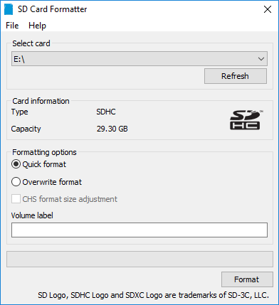
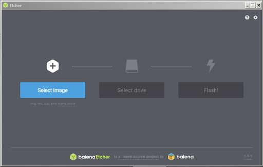
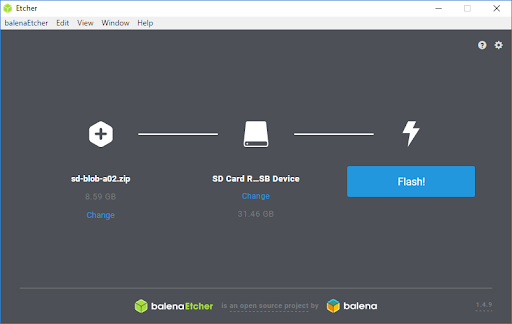
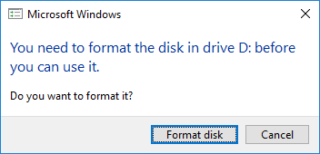
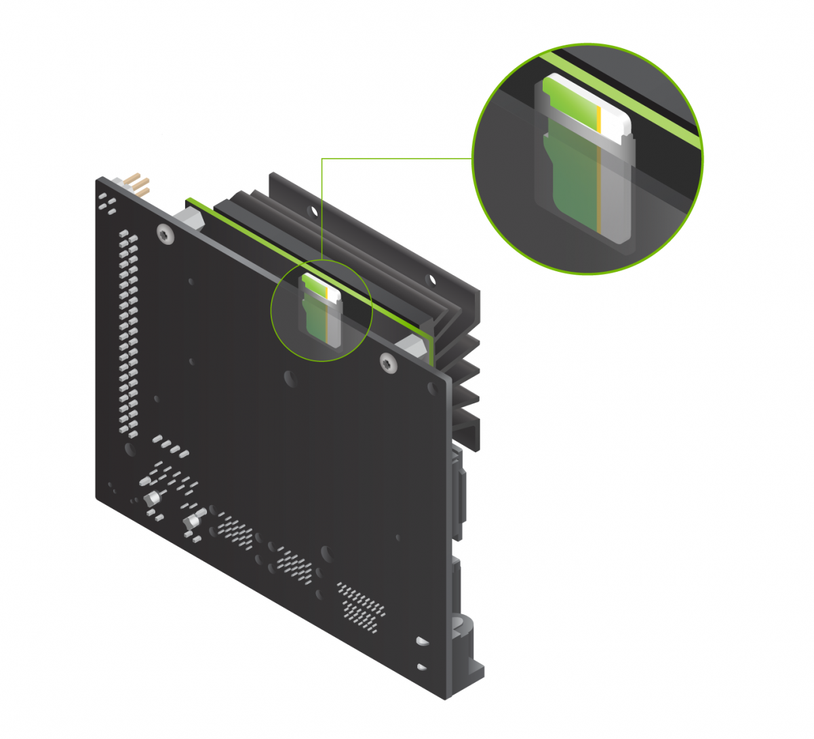

# Setting up your Jetson
## Introduction
The [NVIDIA® Jetson Nano™ Developer Kit](https://developer.nvidia.com/embedded/jetson-nano-developer-kit) is a small AI computer for makers, learners, and developers. After following along with this brief guide, you’ll be ready to start building practical AI applications, cool AI robots, and more.
<div align='center'>
    
</div>

## Write Image to the microSD Card 
To prepare your microSD card, you’ll need a computer with Internet connection and the ability to read and write SD cards, either via a built-in SD card slot or adapter.
1. Download the [Jetson Nano Developer Kit SD Card Image](https://developer.nvidia.com/jetson-nano-sd-card-image), and note where it was saved on the computer.
2. Format your microSD card using [SD Memory Card Formatter](https://www.sdcard.org/downloads/formatter/eula_windows/) from the SD Association:
    * Select card drive.
    * Select “Quick format”
    * Leave “Volume label” blank
    * Click “Format” to start formatting, and “Yes” on the warning dialog

<div align='center'>
    
</div>

3. Use [Etcher](https://www.balena.io/etcher) to write the Jetson Nano Developer Kit SD Card Image to your microSD card:

    <div align ='center'>
        
    </div>

    * Click “Select image” and choose the zipped image file downloaded earlier.
    * Insert your microSD card if not already inserted
    * Click “Select drive” and choose the correct device

    <div align ='center'>
        
    </div>

    * Click “Flash!” It will take Etcher about 10 minutes to write and validate the image if your microSD card is connected via USB3
    * After Etcher finishes, Windows may let you know it doesn’t know how to read the SD Card. Just click Cancel and remove the microSD card.

    <div align ='center'>
        
    </div>

## Boot your Jetson

1. Insert the microSD card (with system image already written to it) into the slot on the underside of the Jetson Nano module.

<div align='center'>
    
</div>

2. Connect Jetson Nano with mouse, keyboard, ethernet cable and monitor (HDIM or Display port).

<div align='center'>
    
</div>

3. Connect a DC power supply to the J25 Power Jack (or Micro-USB power supply). The developer kit will power on automatically.

## Install Requirements
### **1. Jetson Inference**
[Jetson Inference](https://github.com/dusty-nv/jetson-inference) is a library of TensorRT-accelerated deep learning networks for image recognition, object detection with localization (i.e. bounding boxes), and semantic segmentation. This inferencing library (libjetson-inference) is intended to be run on the Jetson, and includes support for both C++ and Python. Various pre-trained DNN models are automatically downloaded to get you up and running quickly.

Here are the commands to build/install the project directly on your Jetson:

``` bash
$ sudo apt-get update
$ sudo apt-get install git cmake libpython3-dev python3-numpy
$ git clone --recursive https://github.com/dusty-nv/jetson-inference
$ cd jetson-inference
$ mkdir build
$ cd build
$ cmake ../
```
> Jetson Inference comes with many pre-trained networks that can you can choose to have downloaded and installed. if you don't mind about it, just skip it by clicking **OK**.

<div align='center'>
    
</div>

> I recommend that you install Pytorch by ticking **'*'** into ***Pytorch v1.1.0 for Python 3.6***.

<div align='center'>
    
</div>

Complete the installation with the following command lines:

```bash
$ make -j$(nproc)
$ sudo make install
$ sudo ldconfig
```
You can see more details about the instructions at [Jetson Inference](https://github.com/dusty-nv/jetson-inference).

### **2. Tensorflow**
[Official TensorFlow](https://forums.developer.nvidia.com/t/official-tensorflow-for-jetson-nano/71770) release for Jetson Nano. Here are the commands to build/install the Tensorflow directly on your Jetson: 

**Check Jetpack version before install:**

```bash
$ sudo apt-cache show nvidia-jetpack
```
**Python 3.6+JetPack4.4:**

```bash
$ sudo apt-get install libhdf5-serial-dev hdf5-tools libhdf5-dev zlib1g-dev zip libjpeg8-dev liblapack-dev libblas-dev gfortran
$ sudo apt-get install python3-pip
$ sudo pip3 install -U pip
$ sudo pip3 install -U pip testresources setuptools numpy==1.16.1 future==0.17.1 mock==3.0.5 h5py==2.9.0 keras_preprocessing==1.0.5 keras_applications==1.0.8 gast==0.2.2 futures protobuf pybind11
```
*Tensorflow 2.X (**Prefer for this project**):*

```bash
$ sudo pip3 install --pre --extra-index-url https://developer.download.nvidia.com/compute/redist/jp/v44 tensorflow==2.3.0+nv20.9
```
*Tensorflow 1.15:*

```bash
$ sudo pip3 install --pre --extra-index-url https://developer.download.nvidia.com/compute/redist/jp/v44 ‘tensorflow<2’
```

### **3. Others**
* [Keras](https://keras.io/):
    ```bash
    $ sudo pip3 install keras
    ```
* [Scipy](https://www.scipy.org/):
    ```bash
    $ sudo pip3 install scipy
    ```
* [Imutils]():
    ```bash
    $ sudo pip3 install imutils
    ```
* [Keyboard](https://pypi.org/project/keyboard/):
    ```bash
    $ sudo pip3 install keyboard
    ```
* [Code OSS - Visual Studio Code](https://code.visualstudio.com):
    ```bash
    $ sudo apt-get update
    $ sudo apt-get install curl
    $ curl -L https://github.com/toolboc/vscode/releases/download/1.32.3/code-oss_1.32.3-arm64.deb -o code-oss_1.32.3-arm64.deb
    $ sudo dpkg -i code-oss_1.32.3-arm64.deb
    $ code-oss 
    ```

You have successfully set up Jetson nano to practice with Artificial Intelligence apps. Congratulations!

## Reference

```
[1] https://github.com/dusty-nv/jetson-inference
[2] https://developer.nvidia.com/embedded/learn/get-started-jetson-nano-devkit
```